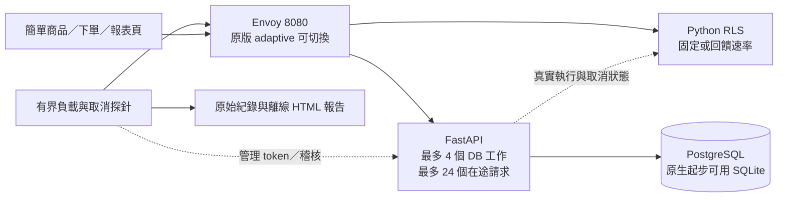

# 應用層資源防護實驗

先做出可重播、可核對交易的防護實驗，再決定研究主張。起始包已解壓至 `local_ddos_lab/`；原始範例紀錄保留在 `examples/smoke_tests/`。新增 Python RLS、PostgreSQL 後端、取消量測、逐商品稽核與 Envoy 部署。

目前是單機應用層資源競爭原型。最新改動與實測數字見 [第一階段改進與驗證](docs/第一階段改進與驗證.md)，早期紀錄見 [原型驗證紀錄](docs/原型驗證紀錄.md)。不要把已提供的設定檔當成已實跑的證據。

第一階段改進已加入可重播的到達相位、逐筆事件對應、後端固定並行基準與證據不足判讀。操作順序是：**啟動 → 確認就緒 → 功能驗收 → 預覽實驗 → 執行 → 看報告 → 停止**。回饋演算法仍保留原版，先用新工具驗證它。

## 做什麼

研究問題：**客戶端斷線時，HTTP 與實際資料庫工作是否存在有影響的時間差？後端占用回饋能否改善正常訂單完成率，而且不大量犧牲正常報表？**

Envoy 的原版 adaptive concurrency 作比較基準。新增的 Python RLS 依後端執行、排隊與取消後仍在執行的工作調整報表速率；這是待驗證的策略，尚未證明比既有產品好。策略看不到測試端的正常／額外需求標籤。



RLS 只做速率准入，沒有「完成後歸還」的並行名額。真正的並行上限由 FastAPI 管理，所有比較組共用；工作完成才歸還名額。這一版每個 DB 工作自行持有連線，尚未加入 PostgreSQL 連線池。

## 先跑原生版

macOS／Linux，於專案根目錄執行。Python 3.12 以上；前端流程測試另需 Node.js：

```bash
python3 -m venv .venv
source .venv/bin/activate
python -m pip install -r requirements-dev.txt
python -m unittest discover -s local_ddos_lab -p 'test_*.py' -v
python -m unittest discover -s rls -p 'test_*.py' -v
python -m unittest deploy.test_config -v
python -m unittest scripts.test_run_comparison -v
node --test local_ddos_lab/test_ui.cjs
python local_ddos_lab/server.py
```

開啟 <http://127.0.0.1:8000> 可以瀏覽商品、建立真的訂單、查詢真的 SQL 報表。另一個終端在專案根目錄執行：

```bash
.venv/bin/python local_ddos_lab/experiment.py --scenario normal --mode off --seconds 30 --label native-sqlite
.venv/bin/python local_ddos_lab/experiment.py --scenario mixed --mode all --seconds 30 --arrival jittered --label native-sqlite
.venv/bin/python local_ddos_lab/cancellation_probe.py --seconds 5 --kind report --seed 42 --arrival jittered --cancel-after-ms 50
.venv/bin/python local_ddos_lab/summarize_results.py
```

`--mode all` 比較起始包後端的 `off/fixed/adaptive`，不會切換 Envoy。測試會清空**專用實驗資料庫**的訂單與重設合成庫存；不要用它連接真實業務資料。

`--arrival periodic` 保留原始週期時程；`jittered` 與 `burst` 在有界窗口內改變到達相位，不增加請求總數。種子同時控制相位，所有比較方法共用相同排程。發生重疊不等於有實際服務損害，請看報告的排隊、worker 占用與正常訂單結果。

操作頁顯示目前後端與 Envoy 模式；單次「檢查狀態」不會啟動負載。`/live` 只表示程序存活，`/health` 會檢查資料庫就緒，結果最多快取 5 秒。下單回應不確定時，請按「以原鍵重試訂單」；實驗重設後舊鍵會被阻擋，須明確開始新實驗訂單。

## 再跑 Envoy＋PostgreSQL

先停止原生服務以釋出 8000 埠。需要 Docker 與 Compose；完整指令與模式說明見 [容器指南](docs/容器與Envoy實驗.md)。

```bash
mkdir -p local_ddos_lab/runtime
export LAB_UID="$(id -u)" LAB_GID="$(id -g)"
docker compose up --build -d --wait
curl --fail http://127.0.0.1:8080/health
docker compose exec -e RUN_LAB_POSTGRES_TESTS=1 app python -m unittest -v test_database.PostgreSQLTests
.venv/bin/python scripts/verify_http.py --base-url http://127.0.0.1:8080
.venv/bin/python scripts/run_comparison.py --scenario mixed --seconds 30 --seed 42 --arrival jittered --plan
.venv/bin/python scripts/run_comparison.py --scenario mixed --seconds 30 --seed 42 --arrival jittered
```

Docker Desktop 使用預設 context 即可。本機已建立專用 Colima profile；在上述容器指令前先執行：

```bash
colima start data-security --cpus 2 --memory 3 --disk 15 --activate=false
export DOCKER_CONTEXT=colima-data-security
```

比較腳本也可明確指定 `--docker-context colima-data-security`。原生與容器不可同時占用 8000。停止容器用 `docker compose down`，不要無故加 `-v` 刪除實驗資料；結束實驗可用 `colima stop data-security` 釋出虛擬機資源。

## 六組比較與取消實驗

六組為共同硬上限、Envoy adaptive、adaptive 加 RLS bypass／fixed／feedback，以及新增的**後端固定報表並行額度**。前五組 app mode=off，最後一組 app mode=fixed、Envoy off。`--fixed-limit 1..3` 設定後端固定組額度；`--report-rounds 1..100` 對所有組別使用相同 SQL 工作量。

```bash
.venv/bin/python scripts/run_comparison.py --workload cancellation --seconds 5 --seed 42 --arrival jittered --repeats 2 --plan
.venv/bin/python scripts/run_comparison.py --workload cancellation --seconds 5 --seed 42 --arrival jittered --repeats 2
```

`--plan` 只列印順序與指令，不接觸 Docker 或資料庫。預設 `--order balanced` 以種子決定初始順序，再每輪輪轉；六輪可讓每組各占一次位置。`--repeats` 允許 1～10，每輪 seed 加一；同輪各組 seed 相同。取消實驗的 wait/cancel 順序預設逐輪交替，原生探針則可用 `--round-order cancel-first` 明確指定。單輪仍只算整合檢查。wait/cancel 會共用 Envoy 控制器；每輪起迄保存代理統計，報告會明示暖機與狀態差異的限制。正式因果研究仍需進一步控制閘道初始化。

輸出位於 `artifacts/comparison-時間/`，其 `comparison.html` 包含普通與取消結果、各輪配對差異、報表取捨與證據限制。`evidence.json` 記錄 DB 重疊、排隊、worker 占用及觀察斷線後的清理時間；`manifest.json` 保存模式、資源、排程雜湊與順序。沒有調速、沒有基準訂單損害或資料不完整時，報告會明確標示，不能只憑 p95 選勝者。

實驗結束後最後一組容器仍在運行。展示可切回原版 adaptive 與 bypass：

```bash
ENVOY_MODE=adaptive RLS_MODE=bypass docker compose up -d --force-recreate --wait rls envoy
.venv/bin/python scripts/verify_http.py --base-url http://127.0.0.1:8080
```

功能驗收會重設合成訂單並將後端模式恢復 off。使用完畢再執行 `docker compose down` 停止容器。

## 檔案分工

| 路徑 | 責任 |
|---|---|
| `local_ddos_lab/server.py` | API、工作上限、有限排隊、取消監測、受保護的管理介面 |
| `database.py`／`postgres_database.py` | 實際交易、冪等、庫存、SQL 期限與取消 |
| `rls/policy.py` | 可單獨測試的 token bucket 與回饋規則 |
| `rls/server.py` | 官方 Envoy gRPC 接口與後端狀態輪詢 |
| `deploy/`／`compose.yaml` | 四種 Envoy 設定與隔離容器 |
| `experiment.py`／`cancellation_probe.py` | 可重播時程、有界流量、逐筆核對、取消觀察 |
| `workload.py`／`event_analysis.py` | 到達相位與事件完整性、重疊、占用分析 |
| `scripts/run_comparison.py` | 六組配對、平衡順序、普通／取消比較及環境證據 |
| `summarize_results.py` | 離線 HTML、每輪差異與證據限制 |

以上 Python 短路徑位於 `local_ddos_lab/`，RLS 路徑則位於專案根目錄。

## 完成標準與邊界

- 正常訂單主指標：預定送出的正常訂單中，期限內回覆正確且資料庫確實存在的比例。預設期限 1 秒，正式測試前固定。
- 同時看正常報表完成率、延遲、拒絕、測試端漏送、取消後殘留時間與訂單／逐商品庫存一致性。
- 主比較使用同一個 PostgreSQL、時程、資源配額與共同安全限制；SQLite 的結果獨立呈現。
- 單次短測試是整合驗證。正式結論需要獨立種子、重複實驗、變動範圍、消融與失敗案例。
- 此版是單 app worker、單 RLS 實例。沒有分散式配額、登入防濫用、網路頻寬清洗或生產環境可用性保證。

[16 週計畫](docs/專案計畫.md) 列出每階段交付與停止條件；[開源與創新分析](docs/開源底座與創新驗證.md) 記錄已有工作及待驗證假說。
